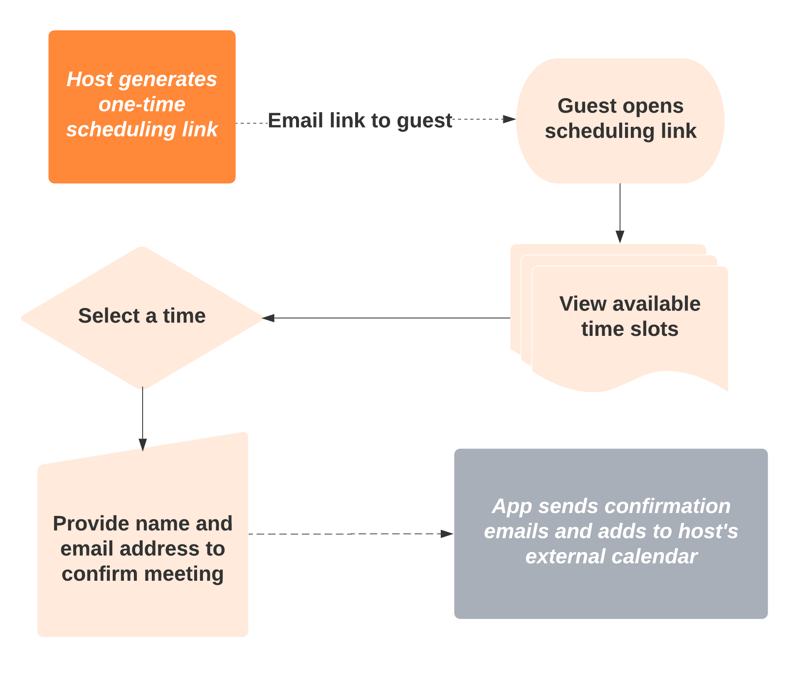
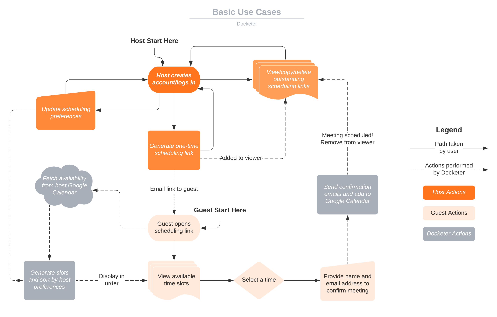
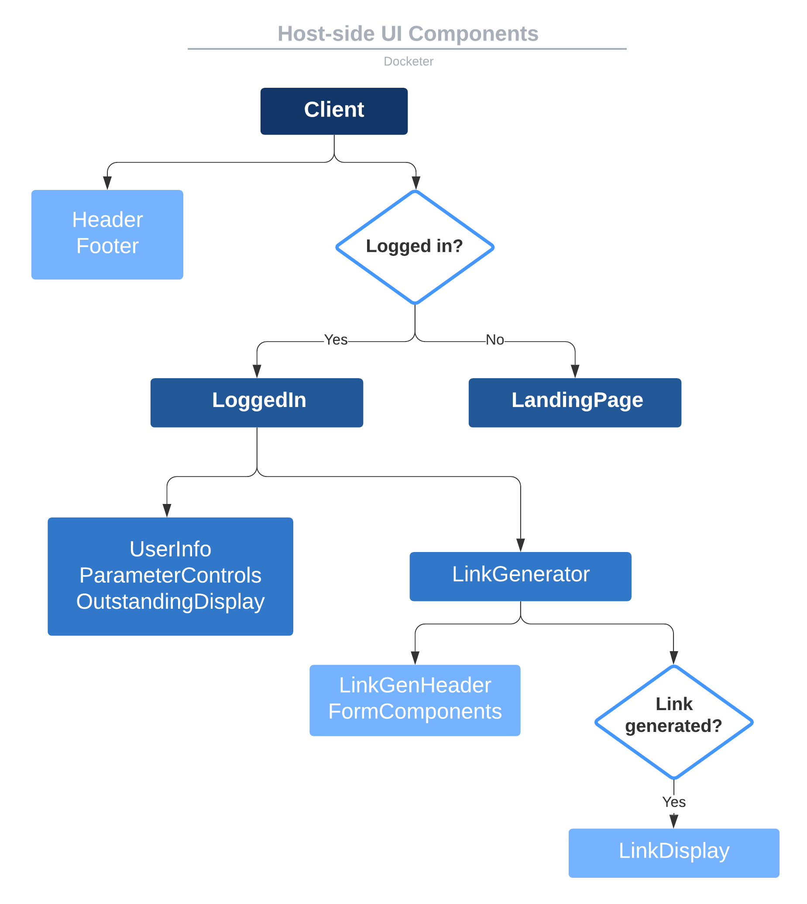
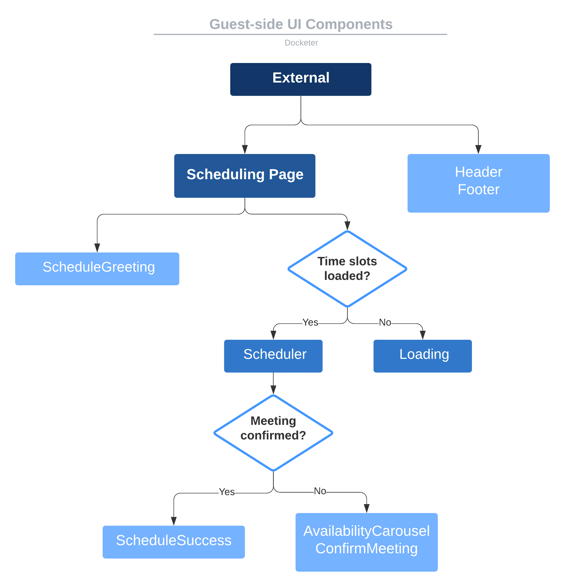
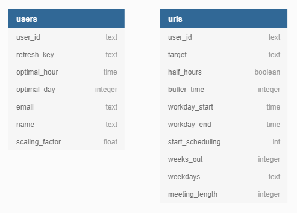
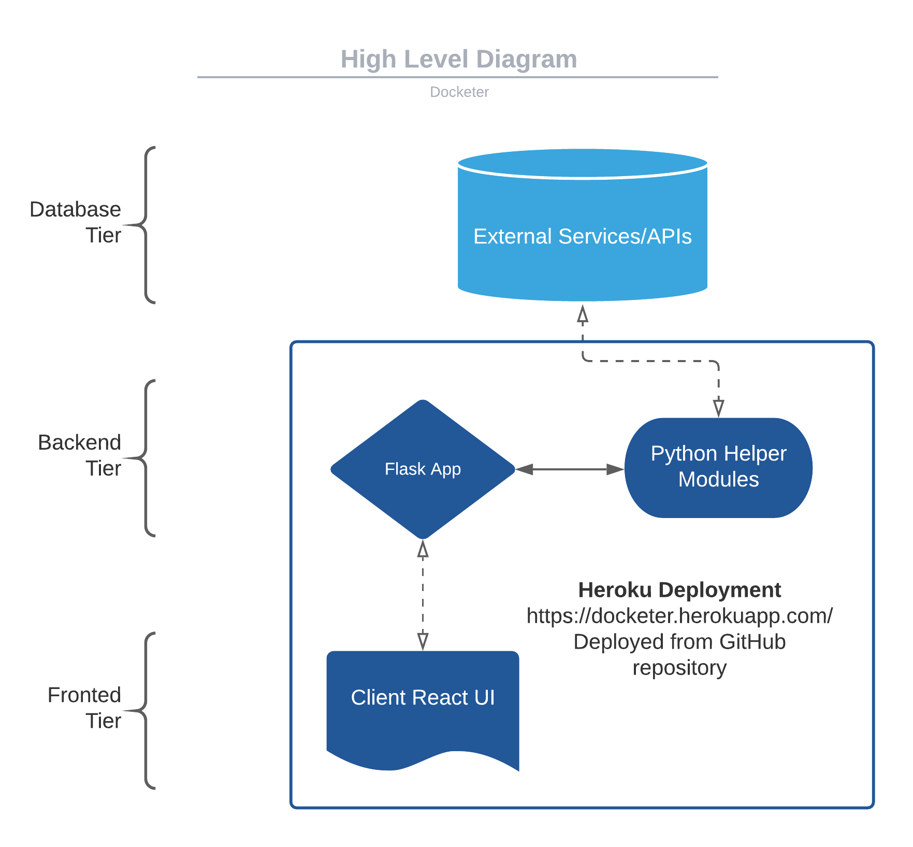
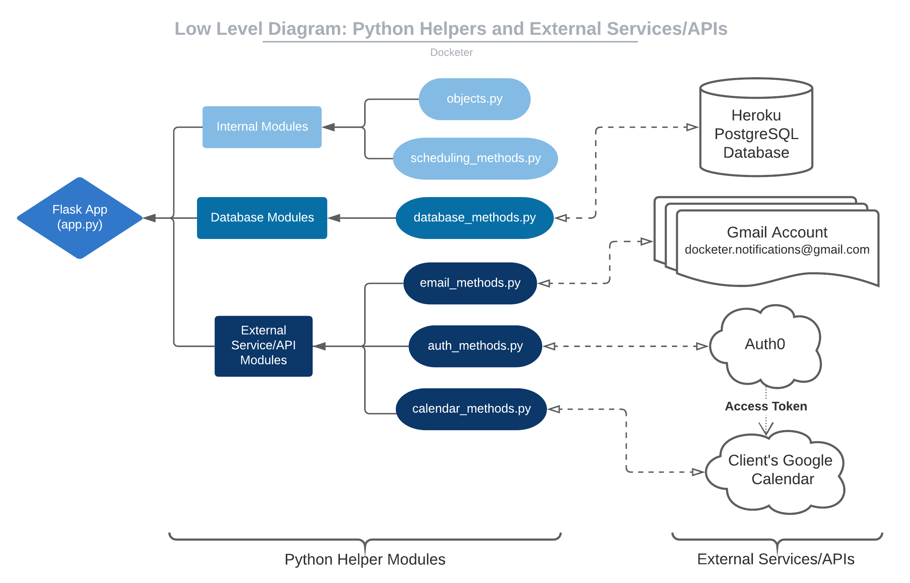

# Docketer
__Sanitized Repository__

Created by Erin Vuong for Junior IW (Spring 2021)
See `full_report.pdf` for the full project writeup.

Deployed at: [`https://docketer.herokuapp.com/`](https://docketer.herokuapp.com/)

__User Guides__:
* [Host User Guide](https://docs.google.com/document/d/1uFg-jsFCzDis5LvxQ1Kj1aIRS7ndyUPSUJRlZSwnoBI/edit?usp=sharing)
* [Guest User Guide](https://docs.google.com/document/d/1FZGoeQps5YBUeevAp_zUig0guIGgJjFvd-dx14NKvZY/edit?usp=sharing)

## Table of Contents
1. App Overview
2. Frontend
3. Backend
4. Running Locally
5. Testing
6. Deploying to Heroku
7. Directory Structure
8. Future Work

## App Overview

A variety of scheduling software already exists to help people arrange meetings (You Can Book Me, Calendly, WhenIsGood, etc.). Many of these options involve sending the guest a booking link to your available time slots and letting them select the option that works best for them, as described in the following diagram.



While this is an easy way to quickly schedule meetings without back-and-forth, not all available time slots are created equal. You may prefer to frontload your day or week. You may prefer to avoid switching back and forth between different tasks and meetings. Current scheduling solutions do not take these preferences into account. Docketer is a scheduling app that more intelligently considers your time management preferences, and incentivizes your guests to pick more preferred slots.

Docketer allows hosts to manage their scheduling links and update preferences used to rank their time. A more detailed view of functions provided by Docketer can be seen in this diagram:



### Ranking Algorithm

Docketer uses three parameters to approximate user preferences: time of day, time of week, and interruption.

__Time of day__ (_D_) can be understood as how preferred a time slot is relative to the user’s scheduling preferences in terms of morning, afternoon, or evening. Quantitatively, this is measured as the distance between the start of the meeting (_s_) and an optimal scheduling hour (_s_o_). The optimal scheduling hour can be understood as the time at which the user would schedule a meeting or task to start given they only have one meeting or task to complete that day.
```
D = | s - s_o |
```

__Time of week__ (_W_) can be understood as how preferred the time slot’s day of the week is. Quantitatively, this is measured as the distance between the time slot’s day of the week (_d_) and an optimal day of the week (_d_o_), which is the day a user would schedule an activity given they only have one activity to schedule in the week.

```
 W = (D_w + (d - d_o)) mod D_w
 ```
 `D_w = 7` is the number of days in a week.
 
__Interruption__ (_I_) measures how much a given time slot breaks up an existing block of free time. Quantitatively, this will be measured as the minimum of the time between the end of the last event (_e_l_) and the start of the time slot (_s_), and the end of the time slot (_e_) and the beginning of the next meeting (_s_n_).

```
 I = min (s - e_l, s_n - e)
```
If there is no event before then _e_l_ is by default 9am, and if there is no event after then _s_n_ is by default 5pm.

Each time slot gets a priority (_P_) using the following equation:
```
 P = a * D + b * W + c * I
 ```
 where _a_, _b_, and _c_ are constants used to normalize the weight of the various parameters to approximately one.
 
 Then, all the time slots are sorted in increasing order of priority using a basic sorting method. Slots with lower priorities are more preferred as they minimize the three parameters, and will be presented to guests first.
 
## Frontend

### Setup
* Ensure you have `npm` installed ([see this link for installation options](https://www.npmjs.com/get-npm)).
* Navigate to `/full-cal-app/react-app` and run `npm install package.json` to install the required node modules.

__WARNING__: Do NOT change `package.json` or `package-lock.json` in the `/full-call-app/react-app` folder, especially by running `npm init`. They were custom updated from the defaults.

### Building
Each time you make changes to the React app, run `npm run build` from `/full-cal-app/react-app` to rebuild the app. This updates the minified production build in `/full-cal-app/flask-server/static` that is deployed to Heroku.

Note that to view changes to the UI on a web browser, you will generally need to refresh your cache after rebuilding and re-deploying (i.e. [by hitting Ctl + F5 for Chrome on Windows](https://www.getfilecloud.com/blog/2015/03/tech-tip-how-to-do-hard-refresh-in-browsers/#.YGshNuhKhaQ)).

### Making Changes
To update the React app you will make changes to or add `.js` and `.jsx` files in `/full-cal-app/react-app/src`, in particular in `/src/components` and `/src/pages`. As the names suggest, `/components` holds smaller React components, and `/pages` holds larger pages. 

__Some important files for adding new pages in `/src`__:
* `App.js`: Wraps the `Main` component from `Main.js`
* `index.js`: The entrypoint; renders `App` from `App.js` to the DOM
* `Main.js`: Holds the router that directs users to the host vs. guest pages. Paths to new pages can probably be added here.
* `Client.js`: For hosts, redirects depending on if they are logged in or not
* `External.js`: For guests, renders the scheduling page

The following diagrams give an idea of the component layout of the various important pages. Most components listed are located in a file named `<component_name>.jsx` in `/react-app/src/components` by themselves. All remaining files in `/react-app/src/components` contain smaller components that are used in one or more places, either in higher-level components or in pages etc. Each file should have a brief description of what the component is intended for.

A diagram of the main components in the host-side UI:



A diagram of the main components in the guest-side UI:



Add images and `.css` files in the `/react-app/public` so they will be accessible to the app and copied over to `/flask-server/static`. To update the base HTML template (i.e. pass variables from the Flask server into the HTML template using Jinja2), edit `index.html` in the `/react-app/public` folder. __Do not__ edit the `index.html` file in `/flask-server/static`, as it will be overwritten the next time you build the React.

__Tips/Things I Learned__:
* To update styles you can try using `.css` files in the `/src` folder, but it seemed to not work usually so instead you can add styles to the `/react-app/public` file (can change `styles.css`)

## Backend

### Setup
You will be running the Flask backend using Python 3.
1. Install required Python libraries by navigating to `/full-cal-app/flask-server` and running
    ```bash
    pip install requirements.txt
    ```
2. For running locally ensure that you have a PostgreSQL database hosted on `localhost` port 5432. To run without changing anything the password for the `postgres` user should be "_test_" and it should contain a database named "_cal_db_". If desired, you can update the `PWD` and `DB_NAME` fields at the top of `database_methods.py`. If running on Heroku with Heroku PostgreSQL added, the app should be able to connect automatically. To test that the database server is running you can run `db_tests.py` in the `/test` folder.

See the next section for details on how to run the app locally.

### Making Changes

The main Flask app is located in `app.py`, and a majority of changes will take place in this file (fixing bugs, defining new routes, etc.). Other files that are important and may be added to/updated are:
* `auth_methods.py`: Methods related to authorizing requests to Auth0 and fetching refresh tokens when a user logs in
* `calendar_methods.py`: Methods used to interact with the Google Calendar API
* `database_methods.py`: SQL Alchemy module for editing the Postgre database
* `email_methods.py`: Methods for sending emails
* `objects.py`: Object class definitions used throughout other files, especially by the database methods
* `scheduling_methods.py`: Methods for generating time slots

See the __Full Directory Structure__ section for a diagram of the Python files and their interactions.

Every time a change is made you should attempt to add a test (or multiple) to verify that it behaves as expected. All previous tests should also still be passing. You should also test manually by running the app locally and walking through at least everything that touches your changes before deploying to Heroku.

### The Postgres Database
Docketer uses the Heroku Postgres server to store user and scheduling link information. The methods in `/flask-server/database_methods.py` use SQLAlchemy to interact with the database using SQLAlchemy objects defined in `/flask-server/objects.py`.

Database structure diagram ([source](https://dbdiagram.io/d/602541d180d742080a3a28dd)):




### External APIs
Docketer uses several external APIs.

[Auth0](https://auth0.com/) provides user authentication. Logins work by redirecting the user to Auth0 who authenticates them using their Google account, then redirects the user back to a callback in the Flask app that handles their logged in profile and finally redirects them to the correct user page. Please note that all callback and logout urls must be entered into the app settings in the Auth0 dashboard before they will work. As a result, local testing can only (currently) be done on port 3000.

Docketer uses the [Google Calendar API](https://developers.google.com/calendar) to fetch availability and add scheduled meetings to user calendars. `/flask-server/client_secret.json` holds the private API keys that are used when making requests to the GCal API. Please keep this information private. Docketer is not yet verified by Google. As a result, it is not accessible by the general public. Test users can be added from the [Google Developer Console](https://console.developers.google.com/). There is a limit of 100 test users. For some reason `@princeton.edu` accounts do not work as test users (they will encounter an error even after added as a test user), and I would assume the same applies for other university accounts. Please do not waste test users by adding university accounts. 

Docketer sends emails by logging in remotely to `docketer.notifications@gmail.com` and sending emails. This email account is not very secure as I had to lower the security settings to allow external services to log in. Do not send or store any sensitive information on this account.

## Running Locally

1. To run locally, first ensure that you have performed the required setup in the __Frontend__ and __Backend__ sections.
2. Navigate to `/full-cal-app/flask-server` and run the command
    ```bash
    python server.py 3000
    ```
    This will start the Flask app on port 3000. Note that it is required that you use port 3000, as Auth0 only allows certain expected callbacks and logout urls (see the __Backend__ section).
3. Now you can visit `http://localhost:3000/` to view your app hosted locally.

## Automated Testing
The test suite for regression testing is stored in the `/full-cal-app/flask-server/test` folder. It contains:
* Backend tests for helper modules (object tests, database module tests, scheduling method tests), as well as the Flask app
* Tests for the React frontend written in Python using Selenium

See below for details on which files fall in which category and how to run and update the tests.

### Python `unittest`
For all tests the Python [`unittest`](https://docs.python.org/3/library/unittest.html) framework was used.

Test output for passing all tests will look like this:
```bash
.........
----------------------------------------------------------------------
Ran 9 tests in 89.654s

OK
```
If tests are failing, error messages will be printed for each failing test.

To run a specific test run the following:
```bash
python <test_py_file> <test_class>.<test_name>
```
For example use the following command to run a header and footer frontend test for the host-side frontend from `test_frontend_host.py`:
```bash
python test_frontend_host.py TestLoggedIn.test_login_logout
```
For more information see this information on the [`unittest` command line interface](https://docs.python.org/3/library/unittest.html#command-line-interface).

### Backend Tests
To run the backend tests you merely need to choose the relevant file and run it using
```bash
python <test_file>.py
```

Possible test files located in `/test` are:
* `object_tests.py`: Tests for the Python objects defined in `/flask-server/objects.py`
* `scheduling_methods_test.py`: Tests for the scheduling-related methods located in `/flask-server/scheduling_methods.py`
* `db_tests.py` and `troublesome_db_test.py`: Tests for the SQL Alchemy module found in `/flask-server/database_methods.py`. Ensure that your SQL database is running before starting these tests.
*  `flask_tests.py`: Tests for the Flask app in `/flask-server/app.py`

__Manual Testing Requirements__:
The following paths and methods are currently not being tested by automation due to permissions requirements from External APIs. While they may be testable by creating a test Google account eventually, it may require considerable maintenance to ensure the tests continue working.
* `auth_methods.py`: Auth0 authorization methods must be tested manually by opening Docketer and logging in. You may also want to try loggin in via [https://docketer.herokuapp.com/login_force](https://docketer.herokuapp.com/login_force), which is a path used to force new refresh token production from Google and will be closer to what new users see (also used for fixing broken refresh tokens). 
* `calendar_methods.py`: Requires accessing Google Calendar, test by manually generating a link and then scheduling a meeting and checking events from your calendar are respected during scheduling and that the event is added to your calendar afterwards
* `email_methods.py`: Requires accessing the Gmail account, test by manually generating a link and then scheduling a meeting and checking both your and the app's emails
* The following paths or sections of `app.py`:
    * `/callback`: The redirect URL for coming back from Auth0 login because it requires Auth0 authentication, test by manually logging in
    * Refresh token errors in `/fetch_times` and `/callback`: can be tested by corrupting the refresh token stored in the DB and then logging in as host & (separately) attempting to schedule as a guest, then following the instructions in the warning email or in the alert on the host page.
    * `/`: The base method just renders some HTML and calls the react script, test implicitly by opening the app manually and checking other things work

__Tips/Things I Learned__:
* There are two database test files because for some reason when all of the tests run sequentially they hang (I would assume for some locking/concurency reason). I wasn't able to find a fix, so this was the solution I found to ensure they don't hang.
* For the Flask tests I had trouble initially figuring out how to edit the Flask session to elicit certain responses. If you wish to add a test with such functionality please see the `flask_tests.py` file. At minimum, for any request that requires a logged in user you will need to add a `profile` field to the Flask session with a `user_id`.
  
### Frontend Tests

Ah, the joy of frontend testing. Luckily, this app is relatively simple, both in the interface and in its interactions with the Flask server, so testing is not difficult.

All tests were built using a headless Selenium Firefox webdriver. Documentation can be found [here](https://selenium-python.readthedocs.io/).

__Relevant files__:
* `test_app.py` contains a mock server that imitates the real Flask app without requiring fetching information from the database or external APIs. It supports all routes that the front end requires directly (all paths except `/login_force`)), and returns stored constants in the same form as what the actual Flask app returns. This file is stored in `/full-cal-app/flask-server` instead of the `/test` directory because it needs access to the Javascript resources to serve the frontend. If you make changes to `app.py` you may need to alter `test_app.py` to ensure that it is consistent.
* `frontend.py` in the `/test` folder holds the `TestBase` class for frontend tests and common methods used between host and guest testing, as well as the various frontend test classes.
* `test_frontend_guest.py` holds frontend tests for the guest (scheduling) page
* `test_frontend_host.py` holds frontend tests for the host pages (homepage and logged in page)

__To run the tests__:
1. Ensure that you have successfully rebuilt the frontend if you made any changes to it that you hope to test, and that you have installed the requirements in `requirements.txt` (see the Frontend and Backend Sections for more information).
2. Navigate to `/full-cal-app/flask-server` and start the test server by running
    ```bash
    python test_app.py
    ```
    This will start the test server on the `localhost` at port 3000.
3. Open a new terminal instance and navigate to `/full-cal-app/flask-server/test`. To run all guest-side tests run
    ```bash
    python test_frontend_guest.py
    ```
    and to run host-side tests run
    ```bash
    python test_frontend_host.py
    ```
    Note that this may take some time. 

## Deploying to Heroku

To deploy to Heroku navigate into `full-cal-app/` and run the following command ([source](https://medium.com/@shalandy/deploy-git-subdirectory-to-heroku-ea05e95fce1f
)):
```bash
git subtree push --prefix flask-server/ heroku master
```

This github repository holds both the React used to build the UI (`react-app/`), and the flask server used to deploy it and handle backend logic (`flask-server/`).`flask-server/` also contains the compiled, minified JS for the React production build (`flask-server/static/react`). This means that only `flask-server/` needs to be deployed to Heroku. Note that as the full repository is not being deployed, the Heroku deployment status in the right sidebar on GitHub will not be accurate.

The app is deployed at [`https://docketer.herokuapp.com/`](https://docketer.herokuapp.com/).

## Full Directory Structure
__System Overview__:

Docketer is a three-tiered networked web application. The following diagram provides an overview of  the three tiers:




The backend tier consists of various Python modules that interact with the external services and APIs that make up the database tier and provide functionality for the Flask app.



__Notes for the diagram below__:
- Some organizationally unimportant files were omitted.
- Files and groups/folders with an asterisk (\*) are files likely to be edited when changing some functionality on either the front or back end. 
<pre>
|-- docketer
    |-- .gitignore
    |-- README.md
    |-- images                                        # Images for the README
    |   |-- db_diagram.png
    |   |-- high_level.png
    |   |-- templates-low_level.png
    |   |-- use_cases_simple.png
    |   |-- use_cases.png
    |   |-- host_side.png
    |   |-- guest_side.png
    |
    |-- flask-server                                  # BACKEND FUNCTIONALITY
    |   |-- app.py                                    #* the main flask server app
    |   |
    |   |                                             #* BACKEND HELPERS
    |   |-- objects.py                                # object definitions
    |   |-- auth_methods.py
    |   |-- database_methods.py                       # Dorm (sql alchemy)
    |   |-- scheduling_methods.py                     # parsing availability
    |   |-- calendar_methods.py                       # Google Calendar methods
    |   |-- email_methods.py                          # Sending emails
    |   |
    |   |-- client_secret.json                        # credentials for auth
    |   |
    |   |-- Procfile                                  # FOR HEROKU DEPLOYMENT
    |   |-- requirements.txt
    |   |-- runtime.txt
    |   |
    |   |-- run                                       # LOCAL TESTING
    |   |-- server.log                                # (https://localhost:3000/)  
    |   |-- server.py
    |   |
    |   |-- test_app.py                               # server for frontend tests
    |   |
    |   |-- test                                      # TESTS (frontend/backend)
    |   |   |                                         # BACKEND (db/Flask/Python)
    |   |   |-- db_tests.py                           
    |   |   |-- object_tests.py
    |   |   |-- scheduling_methods_test.py
    |   |   |-- troublesome_db_test.py
    |   |   |-- flask_tests.py         
    |   |   |                                           
    |   |   |                                         # FRONTEND (React)
    |   |   |-- frontend.py                           # TestBase, common methods
    |   |   |-- test_frontend_guest.py                # guest-side tests
    |   |   |-- test_frontend_host.py                 # host-side tests
    |   |
    |   |-- static   
    |   |   |               
    |   |   |-- images                                # IMAGES/ICONS
    |   |   |   |-- android-chrome-192x192.png
    |   |   |   |-- android-chrome-512x512.png
    |   |   |   |-- apple-touch-icon.png
    |   |   |   |-- favicon-16x16.png
    |   |   |   |-- favicon-32x32.png
    |   |   |   |-- favicon.ico
    |   |   |   |
    |   |   |-- react                                 # BUILT BY REACT DON'T TOUCH
    |   |      
    |   |-- templates                                 # BUILT BY REACT DON'T TOUCH
    |   |   |-- index.html                            
    |   |   |
    |-- react-app                                     # FRONT END DEVELOPMENT
        |                                   
        |-- build                                     # SCRIPTS
        |
        |-- package-lock.json                         # MISC
        |-- package.json
        |-- README.md
        |
        |-- config                                    # CONFIG FILES (Don't mess with)
        |
        |-- public                                    # ACCESSIBLE FILES
        |   |-- index.html                            #* base HTML template
        |   |                                         # (change HTML here if needed)
        |   |-- manifest.json
        |   |-- robots.txt
        |   |-- styles.css                            #* update styles here if needed
        |   |                                         
        |   |-- images                                # SAME IMAGES
        |       |-- android-chrome-192x192.png
        |       |-- android-chrome-512x512.png
        |       |-- apple-touch-icon.png
        |       |-- favicon-16x16.png
        |       |-- favicon-32x32.png
        |       |-- favicon.ico
        |
        |-- scripts                                    # SCRIPTS
        |   |-- build.js                               # (created by create-react-app)
        |   |-- start.js
        |   |-- test.js
        |
        |-- src                                        #* REACT JS FILES
            |                                          # Make UI Changes here
            |
            |                                          # MAIN JS FILES
            |-- index.js                               # file that renders (router)
            |-- index.css
            |
            |-- App.js                                 # Main + footer
            |-- App.css
            |
            |-- Main.js                                # Routing paths (client or external)
            |
            |-- Client.js                              # For logged in/out
            |-- External.js                            # For scheduling
            |
            |-- helper.js                              # Helper methods
            |
            |-- pages                                  # PAGES
            |   |-- LandingPage.jsx                    # Non-logged in
            |   |-- LoggedIn.jsx                       # Logged in
            |   |-- SchedulingPage.jsx                 # Scheduling
            |
            |-- components                             # SMALL COMPONENTS
                |-- Header.jsx                         
                |-- Footer.jsx                    
                |
                |-- FormComponents.jsx                 # General form components
                |
                |-- Scheduler.jsx                      # MAIN SCHEDULING COMPONENT
                |
                |-- ScheduleGreeting.jsx               # Greeting for scheduling
                |-- Loading.jsx                        # Loading screen
                |-- AvailabilityCarousel.jsx           # List of availability
                |-- TimeSlot.jsx                       # TimeSlot representation
                |-- ScheduleSuccess.jsx                # Post-confirmation modal
                |
                |-- OutOfTime.jsx                      # Out of slots page             
                |-- ConfirmMeeting.jsx                 # Confirmation page
                |-- ConfirmForm.jsx                    # Form
                |
                |                                      # LOGGED IN USER
                |-- UserInfo.jsx                       # Name and email         
                |
                |-- LinkGenerator.jsx                  # Generate scheduling link
                |-- LinkGenHeader.jsx                  # Header for link generation form
                |-- LinkDisplay.jsx                    # Display scheduling link
                |
                |-- OutstandingDisplay.jsx             # Display oustanding links
                |
                |-- ParameterControls.jsx              # Update preferences
</pre>

## Future Work
- [ ] Perform usability tests with test users
- [ ] Compare user experiences with another existing scheduling app to evaluate Docketer's approach
- [ ] Perform user evaluation to optimize the preference cost function
- [ ] Consider alternative approaches (i.e. instead of ranking and presenting one by one...)
